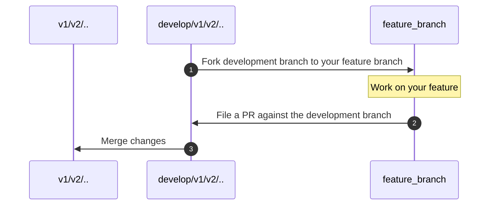

# CONTRIBUTING

❤❤❤🎉 Thank you for considering to contribute to this project! 🎉❤❤❤

The following is a set of guidelines that we ask you to follow when you contribute to this project.

# Index

* [tl;dr](#tldr)
* [Please Be Nice](#please-be-nice)
* [Please Use Correct Medium (GitHub Issues / Discussions)](#please-use-correct-medium-github-issues--discussions)
* [Please Include (Pseudo)code for Any Technical Issues](#please-include-pseudocode-for-any-technical-issues)
* [Reviewer/Reviewee Guidelines](#reviewer-reviewee-guidelines)
* [Brown M&M Clause](#brown-mm-clause)
* [Pull Requests](#pull-requests)
  * [Branches](#branches)
  * [Generated Files](#generated-files)
  * [Test Cases](#test-cases)

# tl;dr

* 📕 Please read this Guideline in its entirety once, if at least to check the headings.
* 🙋 Please be nice, and please be aware that we are not providing this software as a hobby.
* 💬 Open-ended questions and inquiries go to [Discussions](https://github.com/lestrrat-go/jwx/discussions).
* 🖥️ Actionable, specific technical questions go to [Issues](https://github.com/lestrrat-go/jwx/issues).
* 📝 Please always include (pseudo)code for any technical questions/issues.
* 🔒 Issues, PR, and other posts may be closed or not addressed if you do not follow these guidelines

# Please Be Nice

[Main source; if wording differ, the main source supersedes this copy](https://github.com/lestrrat-go/contributions/blob/main/Contributions.md)

Please be nice when you contact us.

We are very glad that you find this project useful, and we intend to provide software that help you.

You do not have to thank us, but please bare in mind that this is an opensource project that is provided **as-is**.
This means that we are **NOT** obligated to support you, work for you, do your homework/research for you,
or otherwise heed to you needs.

We do not owe you one bit of code, or a fix, even if it's a critical one.

We write software because we're curious, we fix bugs because we have integrity.

But we do not owe you anything. Please do not order us to work for you.
We are not your support staff, and we are not here to do your research.
We are willing to help, but only as long as you are being nice to us.

# Please Use Correct Medium (GitHub Issues / Discussions)

[Main source; this is a specialized version copied from the main source](https://github.com/lestrrat-go/contributions/blob/main/Contributions.md)

This project uses [GitHub Issues](https://github.com/lestrrat-go/jwx/issues) to deal with technical issues
including bug reports, proposing new API, and otherwise issues that are directly actionable.

Inquiries, questions about the usage, maintenance policies, and other open-ended
questions/discussions should be posted to [GitHub Discussions](https://github.com/lestrrat-go/jwx/discussions).

# Please Include (Pseudo)code for Any Technical Issues

[Main source; if wording differ, the main source supersedes this copy](https://github.com/lestrrat-go/contributions/blob/main/Contributions.md)

Your report should contain clear, concise description of the issue that you are facing.
However, at the same time please always include (pseudo)code in report.

English may not be your forte, but we all should speak the common language of code.
Rather than trying to write an entire essay or beat around the bush, which will
more than likely cost both you and the maintainers extra roundtrips to communicate,
please use code to describe _exactly_ what you are trying to achieve.

Good reports should contain (in order of preference):

1. Complete Go-style test code.
1. Code snippet that clearly shows the intent of your code.
1. Pseudocode that shows how you would want the API to work.

As we are dealing with code, ultimately there is
no better way to convey what you are trying to do than to provide
your code.

Please help us help you by providing us with a reproducible code.

# Reviewer/Reviewee Guidelines

If you are curious about what what gets reviewed and why some decisions
are made the way they are, please read [this document](https://github.com/lestrrat-go/contributions/blob/main/Reviews.md) to get some insight into the thinking process.

# Brown M&M Clause

If you came here from an issue/PR template, please make sure to delete
the section on "Contribution Guidelines" from the template.

Failure to do so may result in the maintainers assuming that you have
not fully read the guidelines.

[(Reference)](https://www.insider.com/van-halen-brown-m-ms-contract-2016-9)

# Pull Requests

## Branches

### `vXXX` branches

Stable releases, such as `v1`, `v2`, etc. Please do not work against these branches.
Use the `develop/vXXX` branches instead.

### `develop/vXXX` branches

Development occurs on these branches. If you are wishing to make changes against
`v2`, work on `develop/v2` branch.

When you make a PR, fork this branch, make your changes and create a PR against
these development branches.

## Generated Files

All files with file names ending in `_gen.go` are generated by a tool. These files
should not be modified directly. Instead, find out the tool that is generating the
file by inspecting the file. Usually the tool that generated the file is listed
in the comment section at the top of the file.

Usually these files are generated based on a rule file (such as a YAML file).
When you craft a pull request, you should include both changes to the rule file(s)
and the generated file(s). The CI will run `go generate` and make sure that
there are no extra `diff`s that have not been committed.

## Test Cases

In general any code change must be accompanied with test case.

It is obviously very important to test the functionality. But adding test cases
also gives you the opportunity to check for yourself how the new code should/can
be used in practice. Test cases also act as a great way to communicate any
assumptions or requirements that your code needs in order to function properly.

