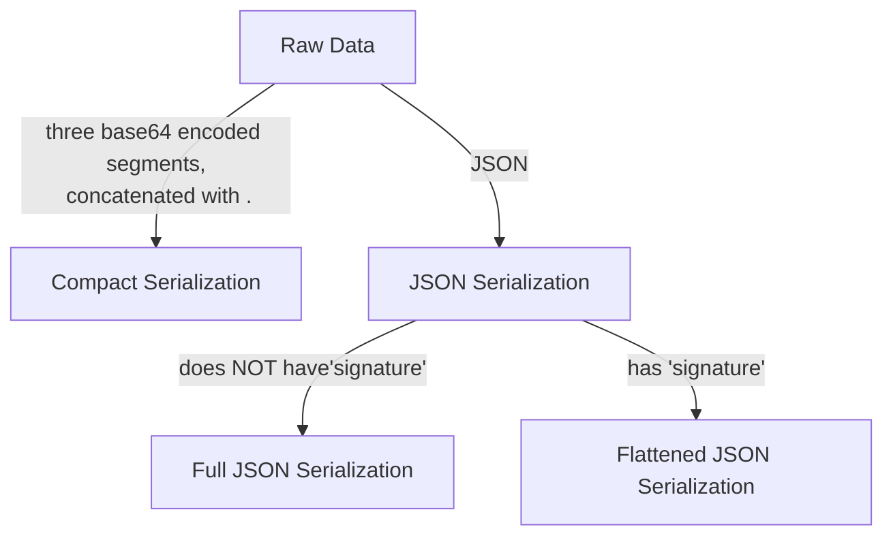

# 1. Anatomy of JOSE and JWX

In this article we will briefly go over what JOSE is, and how each JWX libraries map to the respective RFCs.

---

# JOSE Overview

Javascript Object Signing and Encryption is mainly comprised of specifications that span over 5 RFCs: namely RFC7515, RFC7516, RFC7517, RFC7518, and RFC7519.

* [RFC 7515 - JSON Web Signature (JWS)](https://tools.ietf.org/html/rfc7515)
* [RFC 7516 - JSON Web Encryption (JWE)](https://tools.ietf.org/html/rfc7516)
* [RFC 7517 - JSON Web Key (JWK)](https://tools.ietf.org/html/rfc7517)
* [RFC 7518 - JSON Web Algorithms (JWA)](https://tools.ietf.org/html/rfc7518)
* [RFC 7519 - JSON Web Token (JWT)](https://tools.ietf.org/html/rfc7519)

As there are many RFCs involved, at first it could be daunting. But here is a breakdown for beginners.

While there are other standards and RFCs available related to JOSE such as extensions like ES256K, the above 5 concepts are at the core.

JWX is a Go specific implementation of the JOSE ecosystem, and attempts to do this as cleanly as possible.

# JWT - RFC7519

First, you are probably here because you were trying to work with JWTs, which is described in RFC7519. 

JWTs are implemented in github.com/lestrrat-go/jwx/v2/jwt package. There is also a package to deal with OpenID extensions in github.com/lestrrat-go/jwx/v2/jwt/openid. 

In its essence, there is nothing special about JWTs: they are just a standardized format to exchange some piece of information.

Most of the times this information must be integrity checked using signatures, securely encrypted, or both.

While they are referenced from RFC7519, the standardized message formats for signed and/or encrypted JWTs are not in the same RFC.

As a side note, many libraries bundle these signature/encryption features into one JWT package, and API becomes tightly coupled with the JWT, which I find confusing and hard to fix/extend- which is part of the reason why JWX was born.

## Documentation for `github.com/lestrrat-go/jwx/v2/jwt`

* [FAQ-style HOW-TOs](./01-jwt.md)
* [Documentation on pkg.go.dev](https://pkg.go.dev/github.com/lestrrat-go/jwx/v2/jwt)

# JWS - RFC7515

RFC7515 describes JWS, which is used to sign payloads. The format is not necessarily for JWTs: it can sign any arbitrary piece of data.

The signed content can be encoded in two different formats. The most common one is called the compact form, and takes the form of three base64 encoded strings, concatenated by a single period ("."). The other format takes the form of a JSON object.

```
# An example of a "compact" JWS message
eyJhbGciOiJFUzI1NiJ9.SGVsbG8sIFdvcmxkCg.3q5N5JyFphiJolUZuBuUZhuWDfmLDR__rZe3lnuaxWe3bfrfvJS9HmUUhie56NqkyN7vjOl8hm6tzJKTc2oNsg
```

Please note that a JWS message may take three forms: compact, full JSON, and flattened JSON serialization.



JWS is implemented in github.com/lestrrat-go/jwx/v2/jws package. This package provides ways to sign arbitrary payload into JWS message, and ways to verify them.

## Documentation for `github.com/lestrrat-go/jwx/v2/jws`

* [FAQ-style HOW-TOs](./02-jws.md)
* [Documentation on pkg.go.dev](https://pkg.go.dev/github.com/lestrrat-go/jwx/v2/jws)

# JWE - RFC7516

RFC7516 describes JWE which is used to encrypt data. Similar to JWS, JWE describes the standardized format to encrypt any arbitrary data, not just JWTs.

And again, similar to JWS, JWE can encode data into two different formats, one of which consists of 5 base64 encoded strings concatenated by a single period ("."). The other format takes the form of a JSON object.

```
# An example of JWE message
eyJhbGciOiJFQ0RILUVTIiwiZW5jIjoiQTE5MkdDTSIsImVwayI6eyJjcnYiOiJQLTI1NiIsImt0eSI6IkVDIiwieCI6IndMckhLNnBTLXZzdmhQZUNfNTN0ZWpxYzZIZUFsMllRWDRmY1hPNGV1bmciLCJ5IjoiV2V3bFdKazJ4QWJYSXE3WFJ6aVlZa2lxMjJfOF9TQ0VsbTA1Vm1iUGhFWSJ9fQ..7UTcbVpz-Ed1Q0wq.sneVfeTeAvzZNSMGpQ.JNo1BbDaKB-Q1mWaBNmdow
```

JWE is implemented in github.com/lestrrat-go/jwe package. This package provides tools to encrypt payload into JWE messages, and tools to decrypt them.

## Documentation for `github.com/lestrrat-go/jwx/v2/jwe`

* [Documentation on pkg.go.dev](https://pkg.go.dev/github.com/lestrrat-go/jwx/v2/jwe)

# JWK - RFC7517

So JWTs can be signed and/or encrypted using JWS and JWE. However in order to do either operation one needs some sort of a key. This is where RFC757 which describes JWK comes into play.

JWKs describe formats to describe keys, such as RSA keys, Elliptic Curve keys, symmetric keys, etc. Each family of keys have a slightly different, unique format, but they are all encoded as JSON objects. 

```
# An example of a JWK
{
  "crv": "P-256",
  "d": "vVLuV63SADBsZrixRXs3hcteS7SaBrMPnxERz6G1xZ8",
  "kty": "EC",
  "x": "uNs7UU1KU9nug9QrfxLmxLtYZLQDnYcX7_J3zkTkhCk",
  "y": "IGsWjOsDHFbeiQg-Reih-a1BsijmV2RUPPGswl8TRTI"
}
```

JWK is implemented in github.com/lestrrat-go/jwx/v2/jwk package. This package provides ways to generate, read, and manipulate JWKs, convert them to and from raw key formats (e.g. "crypto/rsa".PrivateKey to JWK and vice versa). It can also work with PEM-encoded keys.

## Documentation for `github.com/lestrrat-go/jwx/v2/jwk`

* [FAQ-style HOW-TOs](./04-jwk.md)
* [Documentation on pkg.go.dev](https://pkg.go.dev/github.com/lestrrat-go/jwx/v2/jwk)

# JWA - RFC7518

And finally, RFC exists to define commonly used algorithm names in JWT, JWS, JWE, and JWK. 

This is implemented in github.com/lestrrat-go/jwx/v2/jwa.
